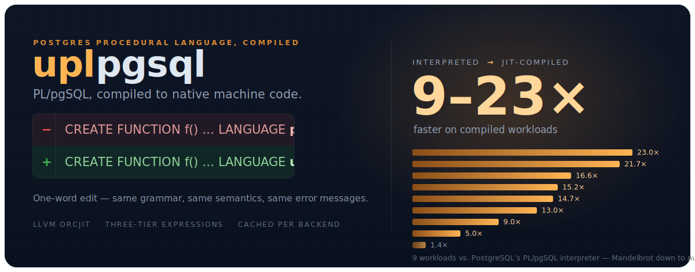

# uplpgsql

<p align="center">
  
</p>

A JIT-compiling PL/pgSQL for Postgres, derived from the NEXTGRES Universal Procedural Language (UPL) compiler and runtime.

> [!WARNING]
> This is a pre-alpha work-in-progress predicated on an AI-assisted analysis and JIT-oriented reconstruction of the UPL compiler and runtime. Do not use it in production. Interfaces and behaviour will change without notice. Crashes, correctness issues, and data loss are very likely.

## What it is

`uplpgsql` is a procedural language handler. Functions declared `LANGUAGE uplpgsql` are compiled to native machine code on first execution and run as native code thereafter. The language they are written in is PL/pgSQL — the same grammar, the same semantics, the same error messages.

Just `CREATE EXTENSION uplpgsql;` and replace `LANGUAGE plpgsql` with `LANGUAGE uplpgsql`.

## Why you would use it

We've long believed in the [Thick Database approach](https://www.youtube.com/watch?v=8jiJDflpw4Y), and putting logic where the data lives; it's fewer round trips, transactional integrity by construction, and a service written in a fraction of the code C would take. That's why much of the [NEXTGRES personalization system](https://nextgres.ai/) is written directly inside the database using PL/SQL. But interpreted procedural languages are often slow and resource hungry. We saw this first-hand, working on many Oracle-to-Postgres migrations, which encountered slower execution times and increased resource utilization. A PL compiler skips that, with the same source at nearly-native speed.

While our services are primarily developed in PL/SQL, our internal compiler also supports PL/pgSQL, SQL/PSM, and T-SQL. We felt it's about time normal Postgres users get some of the same performance benefits, and began rebuilding the compiler using a modern, JIT-oriented approach.

If you have procedural code, want better response times, and lower overhead, this is intended for you.

## How it differs from PL/pgSQL

PostgreSQL's PL/pgSQL is a tree-walking interpreter. Every `IF`, every loop iteration, every assignment costs a switch dispatch and a recursive call through `exec_stmt`. PostgreSQL's own JIT does not help: it compiles SQL expressions and tuple deforming, not procedural control flow.  `uplpgsql` compiles the control flow itself. Statements become LLVM basic blocks and branches; loops become real loops; variable access becomes a load from a computed struct offset. Compiled functions are cached per backend and invalidated on `fn_xmin`/`fn_tid` change, so a `CREATE OR REPLACE` recompiles and nothing stale survives.

How it works:

**Native IR first.** Control flow, arithmetic, and datum access are emitted as instructions. Only operations that inherently require PostgreSQL's C infrastructure — SPI, expression evaluation, tuplestores, subtransactions — delegate to runtime helpers.

**Three-tier expressions.** Integer and float arithmetic compile to overflow intrinsics with no call overhead. Other operators resolve their C function pointer at compile time and bypass fmgr. Anything left falls back to a runtime helper. The fallback is the escape hatch, not the plan.

Everything else is unchanged. The GUCs are mirrored under the `uplpgsql.` prefix (`variable_conflict`, `print_strict_params`, `check_asserts`, `extra_warnings`, `extra_errors`), joined by `uplpgsql.log_compilation`, `uplpgsql.dump_ir`, and `uplpgsql.enable_jit_heuristic`. Porting a function is a one-word edit.

## Universal procedural language

PL/pgSQL is one front-end, not the point. The compiler underneath — UPL — is language-agnostic: it knows about basic blocks, branches, datums, and a JIT, and nothing about any particular procedural dialect.

```
core/     libupl_core.a    LLVM lifecycle, OrcJIT, function cache,
                           IR primitives, datum access
common/   shared PL infra  parser scaffolding, interpreter fallback,
                           statement and expression compilation, runtime helpers
drivers/  one per language grammar, scanner, call handler, extension
```

A driver owns its parser, its AST, and its interpreter fallback. It reaches the JIT only through `upl_emit_*()`. The core never names a language-specific type.  This is what makes the other front-ends tractable: fork the dialect's existing parser, walk its AST, emit through the same primitives.

| Front-end | Status |
|-----------|--------|
| PL/pgSQL  | Working. Tracks PostgreSQL 20devel; 15/15 regression tests pass. |
| SQL/PSM   | Removed. Adds `SIGNAL`/`RESIGNAL`, `REPEAT`, `DECLARE HANDLER`. |
| PL/SQL    | Removed. Adds packages, nested subprograms, collections. |
| T-SQL     | Removed. Adds `TRY`/`CATCH`, `GOTO`, `RAISERROR`. |

Only the PL/pgSQL driver lives in this tree today.

## Building

Requires PostgreSQL 18 or later (18 builds via compatibility shims in `common/upl_plpgsql.h`; development tracks 20devel) and LLVM 15+, and is developed/tested against LLVM 22. The build is C only and uses the LLVM C API only.

PostgreSQL does **not** need to be built `--with-llvm`. `uplpgsql` links its own LLVM and owns its LLJIT instance; it never touches PostgreSQL's `llvmjit` provider. A stock server with no JIT support of its own runs JIT-compiled PL/pgSQL just fine.

```sh
make install
make installcheck
```

Header dependencies are tracked (`-MMD`), so an incremental `make install` rebuilds and ships everything a source or header edit touches. Two caveats. A tree last built before dependency tracking was added has no `.d` files yet and needs one `make clean` to arm it. And under a PostgreSQL built `--with-llvm`, PGXS's bitcode (`.bc`) rule has no dependency tracking of its own, so after header edits the installed bitcode can go stale even though the `.so` is fresh — run `make clean && make install` in that configuration.

## License

Apache 2.0

